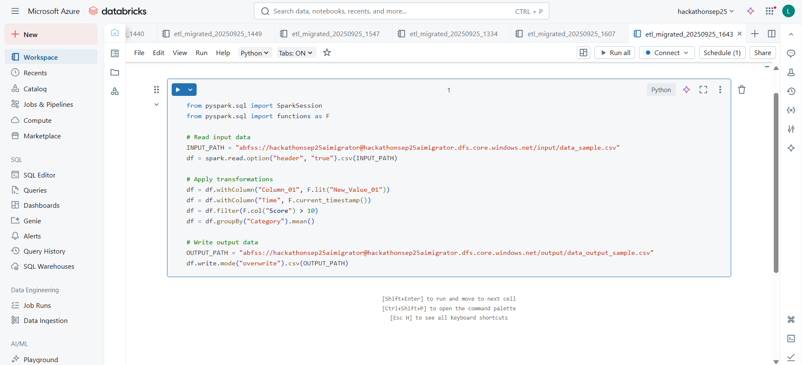
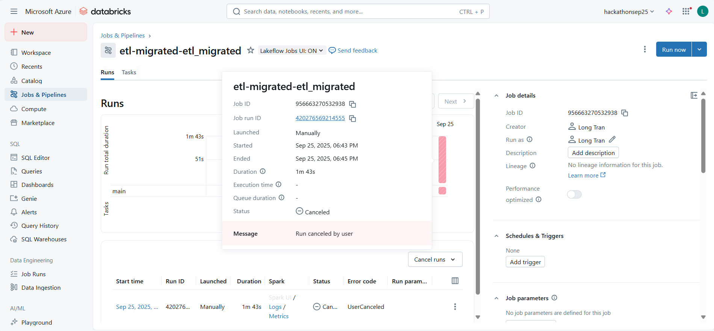

# AI Agents for GitHub → Databricks ETL Migration

End‑to‑end, guardrailed pipeline that:
1. **Clones** a GitHub repo (HTTPS + PAT) to locate a simple pandas ETL.
2. **Analyzes** the ETL and extracts a **deterministic IR** (via Python AST) plus a high‑level semantic plan (LLM).
3. **Converts** the pandas logic to a **PySpark** Databricks **SOURCE .py** notebook following strict rules (no placeholders, correct I/O).
4. **Validates** and **Deploys**: imports the notebook to your Databricks workspace (Unity Catalog paths), creates a **Job**, and optionally **runs** it.


Below are the result of converting a simple etl (can be found in this repo under `src/etl/main.py` )
<p align="center">
  
  <br>
  <em>Figure 1 — Agent-Generated Databricks notebook based on py file</em>
</p>

<p align="center">
  
  <br>
  <em>Figure 2 — Agent-Generated Databricks Job to run the above notebook</em>
</p>

---

## Repository Layout

```
.
├─ src/
│  ├─ etl/                              # Simple pandas ETL (reads/writes Azure Blob)
│  │  ├─ main.py
│  │  └─ ... (helpers, logger, etc.)
│  └─ agents/                           # Agent runner (AST→IR, LLM analysis, conversion, deploy)
│     └─ runner.py                      # (optional) cleaned version with rich docstrings
└─ img/
   ├─ result_databricks_notebook.png
   └─ result_databricks_job.png
```


---

## Why this approach?

**Hybrid determinism + LLMs.** We use Python **AST** to deterministically extract a minimal **Intermediate Representation (IR)** of the ETL (e.g., `add_column`, `filter`, `groupby`) and let the LLM generate the PySpark notebook under **strict HARD RULES**.

**Benefits**
- **Control & Validation** — no placeholders, explicit UC paths, required columns present
- **Traceability** — artifacts: `plan.json`, `ir.json`, `generated_notebook.py`
- **Reliability** — retry with corrective hints if validation fails

---

## Prerequisites

- **Python** 3.10+
- Access to:
  - **Azure OpenAI** (endpoint, API key, deployment name, API version)
  - **Databricks** workspace (host URL + PAT token)
  - **Azure Storage** (for ETL input/output)
  - **GitHub** repo (HTTPS URL + PAT if private)

### Python dependencies (agents)

Create & activate a virtual environment, then install:

```bash
pip install -r requirements.txt
```


---

## Environment Variables

Use **one `.env` at repo root**. Because this repo has **two components** (simple pandas ETL and the agent runner), there are **two sets** of env vars. Include **both** in the same `.env`.

### A) Agent Runner (`src/agents/runner.py`)

Required for cloning, LLM, Databricks, and UC I/O:

```env
# Azure OpenAI
AZURE_OPENAI_ENDPOINT=https://<your-aoai-endpoint>.openai.azure.com/
AZURE_OPENAI_API_KEY=<your-aoai-key>
AZURE_OPENAI_API_VERSION=2024-08-01-preview
AZURE_OPENAI_DEPLOYMENT=<your-chat-deployment-name>

# Databricks
DATABRICKS_HOST=https://<your-workspace>.cloud.databricks.com
DATABRICKS_TOKEN=<your-dbx-pat>

# Git source (this repo or a target repo to migrate)
GIT_REPO_URL=https://github.com/<org>/<repo>.git
GIT_BRANCH=main
GIT_TOKEN=<your-github-pat>

# Unity Catalog-compatible ABFSS paths (used by the generated notebook)
STORAGE_ACCOUNT=<yourstorageaccount>
STORAGE_CONTAINER=<yourcontainer>
INPUT_BLOB_PATH=path/in/container/input.csv
OUTPUT_BLOB_PATH=path/in/container/output/

# Optional cosmetics
JOB_NAME_PREFIX=etl-migrated
WORKSPACE_USER_SUBDIR=etl-migration
```

> The runner **constructs** UC URIs like:
> `abfss://<container>@<account>.dfs.core.windows.net/<path>`

### B) Simple pandas ETL (`src/etl/main.py`)

Required for the **standalone pandas ETL**, which reads/writes Azure Blob via **SAS**:

```env
# Azure Blob via SAS (pandas ETL)
AZURE_STORAGE_ACCOUNT=<yourstorageaccount>
AZURE_CONTAINER=<yourcontainer>
INPUT_BLOB_PATH=path/in/container/input.csv
AZURE_SAS_TOKEN=?sv=2024-...&se=...&sp=...&sig=....
# OPTIONAL: If omitted, the ETL may infer OUTPUT_BLOB_PATH from INPUT_BLOB_PATH
OUTPUT_BLOB_PATH=path/in/container/output/output.csv
```

> **Note**: The pandas ETL has its own helper utilities for blob access. The agent runner does **not** execute the ETL; it only reads the code to extract semantics.

---

## How to Run

### 1) Run the agent pipeline (recommended)

From the repo root:

```bash
python src/agents/runner.py --run-now
```

**What happens**
- Clones the repo (branch + PAT) into a temp folder
- Locates ETL entry (prefers `src/etl/main.py`)
- Saves artifacts under `<cloned_repo>/.artifacts/`:
  - `plan.json` — analyzer’s strict JSON plan
  - `ir.json` — deterministic IR (extracted via AST)
  - `generated_notebook.py` — PySpark SOURCE notebook
- Imports the notebook to `/Users/<you>/<WORKSPACE_USER_SUBDIR>/etl_migrated_<ts>`
- Creates a **Databricks Job** (named from `JOB_NAME_PREFIX`)
- If `--run-now` is set, runs the job and prints a run summary

### 2) (Optional) Run the pandas ETL locally

If you want to test the basic ETL logic as‑is (outside Databricks), ensure the **pandas ETL env vars** are set and run:

```bash
python src/etl/main.py
```

> This will read from your Azure Blob (via SAS), apply simple transforms, and write back to Blob.

---

## Artifacts & Validation

- **`.artifacts/plan.json`** — semantic plan proposed by the analyzer LLM.
- **`.artifacts/ir.json`** — deterministic IR (e.g., `add_column`, `filter`, `groupByReduce`) extracted from the code.
- **`.artifacts/generated_notebook.py`** — the full Databricks SOURCE notebook.

The runner enforces **HARD RULES**:
- Must import `from pyspark.sql import functions as F`
- Must read/write using your **UC paths** (CSV/JSON/Parquet/Delta)
- **No placeholders** (`...`, `path_to_*`)
- **Required columns present** (e.g., from `add_column`, or pandas assignments like `df['HighScore'] = ...`)
- If validation fails, it **regenerates once** with a corrective hint.

---


## Security

- **No code execution** during analysis — AST parsing only.
- GitHub PAT is **masked** in logs.
- Keep secrets in `.env` or a vault (e.g., Azure Key Vault).
- Use least‑privilege tokens for Databricks and Storage.

---

## Roadmap

- Wider IR coverage (joins/windows/pivot/explode)
- Direct translator **fallback** when IR coverage is low (feature flag)
- Unit tests for extractor on a corpus of ETLs
- CI integration: PR comments with artifact diffs

---

## Maintainer

**Long Tran** — long.tran@avanade.com  
Questions or contributions welcome. Open an issue or PR!
